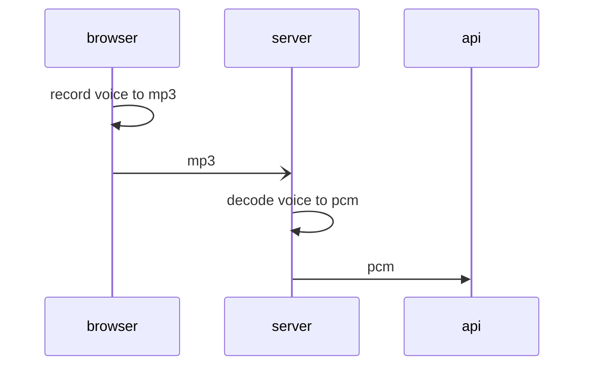

# iat

realtime voice recognition
## infra




## input

Providing an app-view using: nextjs

using

```typescript
const mrRef = useRef(null);
mediaRecorder = new MediaRecorder(stream!, { mimeType: mimeType });
mrRef.current = mediaRecorder;
```

record from user microphone

## convert input to pcm stream

## output

api provider: ifly

s