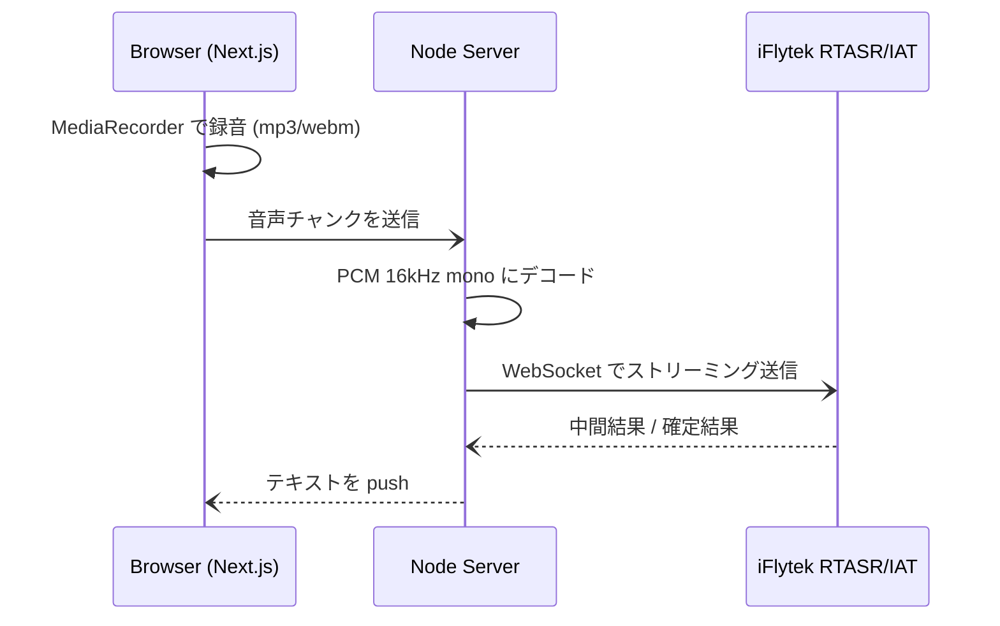

# 01 — 現状アーキテクチャ

## 全体像

## 関連ファイル

- `app/page.tsx` — Next.js 側の録音 UI (`MediaRecorder`)
- `iat-stream/index.js` — iFlytek IAT (短文向け) WebSocket クライアント
- `rtasr-ws-node.js` — iFlytek RTASR (長文向け) WebSocket クライアント
- `iat-stream/getAuthStr.js`, `getWssUrl.js` — 署名・URL 生成
- `pcm.mjs` — PCM 変換ユーティリティ

## 現状の特徴

- **音声入力フォーマット**: 16kHz / 16bit / mono PCM、`highWaterMark: 1280` (40ms フレーム相当) でチャンク送信
- **プロトコル**: WebSocket、HMAC-SHA1 + MD5 署名認証
- **結果モデル**: `seg_id` 単位の確定 (`type=0`) / 中間 (`type=1`) を扱う
- **言語**: 中国語メイン、英語混在は限定的
- **後処理**: なし (素のテキストをそのまま表示)

## 課題

1. iFlytek にロックインされている (国外可用性 / レイテンシ / 料金)
2. 話者分離 (diarization) や言語切替がない
3. 句読点・固有名詞の整形が弱い → LLM polish レイヤが欲しい
4. オフライン / セルフホスト不可
