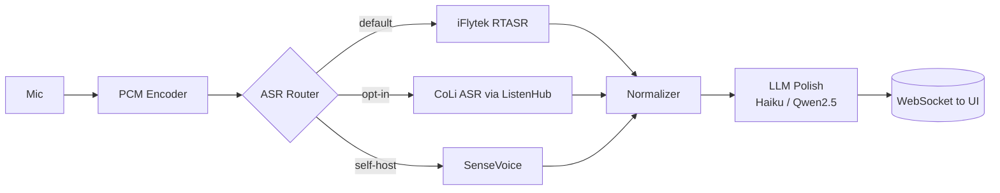

# 04 — 推奨構成と移行ステップ

## 結論 (TL;DR)

- **短期 (1〜2 週)**: 現状の iFlytek RTASR + Claude Haiku polish レイヤを足す。コードは現リポを最小改修で済む。
- **中期 (1〜2 ヶ月)**: ListenHub 経由で **CoLi ASR** をプラガブルに追加し、A/B テストできるようにする。
- **長期 (四半期)**: GPU ノードを 1 台確保して **SenseVoice + Qwen2.5 polish** をセルフホスト。固定費化 + データ主権 + カスタム辞書対応。

## アーキテクチャ (推奨)



「ASR Router」を抽象化して、プラン差し替えを 1 行の設定で済むようにするのが鍵です。

## インターフェース提案

```ts
// src/asr/types.ts
export interface AsrProvider {
  name: "iflytek-rtasr" | "coli" | "sensevoice";
  start(audio: AsyncIterable<Buffer>): AsyncIterable<AsrEvent>;
}

export type AsrEvent =
  | { type: "partial"; segId: number; text: string }
  | { type: "final"; segId: number; text: string; words?: Word[] }
  | { type: "error"; message: string };
```

各プロバイダはこの形に揃え、UI とポリッシャはプロバイダを意識しない。

## 移行ステップ

1. `src/asr/iflytek-rtasr.ts` に既存 `rtasr-ws-node.js` を TypeScript 化して移植
2. `src/polish/haiku.ts` に文単位 polish を実装、`final` イベントを受けて差分送信
3. `src/asr/coli.ts` を ListenHub のドキュメント通りに実装し、env で切り替え
4. ベンチ用に `scripts/bench.ts` を用意 (同じ wav に対し各プランの WER / latency を出す)
5. SenseVoice は `infra/sensevoice/` に Docker compose を切り、FunASR の WebSocket サーバを立ててから `src/asr/sensevoice.ts` を実装

## ベンチ用データセット

- 中文 single-speaker (ニュース読み上げ)
- 中英混在 (テック会議)
- マルチスピーカー会議 (3 人以上)
- ノイズ環境 (カフェ BGM)

各データセットで CER / 句読点 F1 / p95 latency / 円/分 を計測し、`docs/bench/` に結果を蓄積する。
